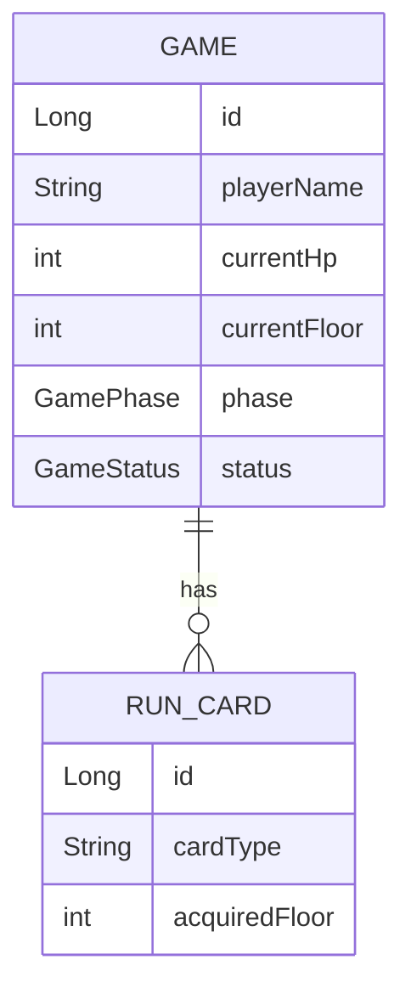

## API 명세

| Method | URL | 설명 | 요청 Body | 응답 |
|---|---|---|---|---|
| POST | /games | 게임 생성 | CreateRequest | 201, GameDetailResponse |
| GET | /games | 게임 목록 조회 | - | 200, List<GameSummaryResponse> |
| GET | /games/{gameId} | 게임 상세 조회 | - | 200, GameDetailResponse |
| PUT | /games/{gameId}/progress | 진행 저장 | ProgressRequest | 200, GameDetailResponse |
| PATCH | /games/{gameId} | 이름 변경 | RenameRequest | 204 |
| DELETE | /games/{gameId} | 게임 삭제 | - | 204 |

## ERD 구조
